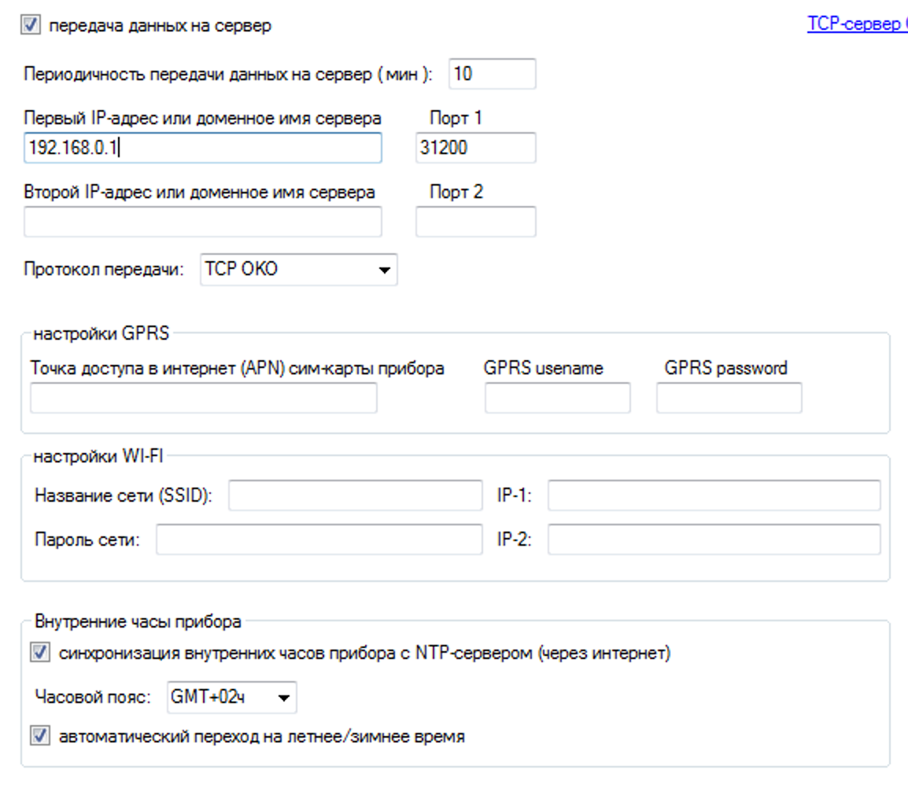

## Principle of work
While first run app will generate two files in `config` folder: `server.json` and `devices.json`  
Each of them contains the corresponding config params. You can edit them at any time to adjust what you need and restart app.  
>`server.json` won't update it self.  
`devices.json` will update when new OKO device connected.  

At the beginning app start a socket server and wait for connections.  
When new connection starts checks if device already exist at DB, if not adds.   
Messages from known devices parses, looks for difference from last message and send them to MQTT server.  
If there is command from MQTT server and open socket for this device it sends command to device until new status message received.  

## First run
### Install
#### Docker
```
docker run -d \  
  --name oko2mqtt \  
  -p 31200:31200 \  
  --mount type=bind,source=[HOST]/config,target=/usr/src/app/config \  
  xyzroe/oko2mqtt  
```
or
#### Local
```
git clone git@github.com:xyzroe/oko2mqtt.git
cd oko2mqtt
pip3 install --no-cache-dir -r requirements.txt
python3 main.py
```
After first start modify params in `server.json` that you need and restart app.

### Add device
  * Configure data transfer settings in OKO device
  * Wait device to connect to server.
  * After first connect modify params in `devices.json` section corresponding to your device IMEI.


### Device config params description

    "imei": "861230040XXXXXX",
    "name": "Unknown",
    "id": "unk",
    "pin": "1234",
    "hw": "OKO-EX",
    "sw": "E.4.2",
    "code": "7777",

    "general": [
        {
            "name": "Тампер",
            "class": "safety"
        },
        {
            "name": "Режим охраны",
            "icon": "mdi:security"
        }
        ],

    "groups": [
        {
            "name": "Группа 4",
            "icon": "mdi:group"
        },
        ],
    "outputs": [
            {
                "name": "Выход 2",
                "icon": "mdi:flash"
            },
        ],  

    "inputs": [
        {
            "name": "Вход 1",
            "class": "window",
            "short": true,
            "cut": true
        },
    ],


    "adcs": [
        {
            "name": "ADC 2",
            "icon": "mdi:speedometer"
        },
    ],

    
    "dallas": [],
    "radios": [],
    "counters": [],
    "ex1_in": [],
    "ex1_out": [],
    "ex2_in": [],
    "ex2_out": [],
    "ex3_in": [],
    "ex3_out": [],
    "ex4_in": [],
    "ex4_out": [],
    "address-sensors": [],
    "others": []


### Server config params description
#### Socket section  
configuring params for Socket server
```
"SOCKET_PORT": 31200,
"SOCKET_TIMEOUT": 90,
"SOCKET_IP": "0.0.0.0",
"SOCKET_LISTEN": 5,
```

**SOCKET_PORT** - TCP port to accept OKO devices connections  
> OKO devices supports different TCP port for the first and second server, but they are the same both for GPRS and Wi-Fi connection.  
>
> While GPRS connection setup your firewall to accept and forward traffic to your server. (meanwhile you can change port at this stage)  
>
>While Wi-Fi connection configure this port to be exactly the same as at device.  

**SOCKET_TIMEOUT** - Timeout in seconds to close OKO devices connections
>If no data is received during this time, the socket connection will be closed.  
>
>This value must be greater than report sending interval configured at device.

**SOCKET_IP** - IP address to accept OKO devices connections
>By setting to 0.0.0.0 accept accept OKO devices connection at any IP address

**SOCKET_LISTEN** - The maximum length of the pending connections queue.
>Change this parameter ONLY if you know what you are doing!

  


#### MQTT section
configuring params to connect to MQTT server
```
"MQTT_USER": " ",
"MQTT_PASSWORD": " ",
"MQTT_IP": "127.0.0.1",
"MQTT_PORT": 1883,
"OKO_PREF": "oko",
"AD_ENBL": true,
"AD_PREF": "homeassistant",
```
**MQTT_USER** - MQTT server authentication user  
**MQTT_PASSWORD** - MQTT server authentication password   
**MQTT_IP** - MQTT server IP address  
**MQTT_PORT** - MQTT server IP port  
**OKO_PREF**- The prefix for the devices topics  
**AD_ENBL** -  Auto discovery publishing enabled or not  
**AD_PREF** - The prefix for the auto discovery topics  

#### Other section  
configuring other application settings
```
"LOG_LEVEL": 30

```
**LOG_LEVEL** - Logging level  

| Level | Value |
|--- | --- |
| CRITICAL | 50 |
| ERROR | 40 |
| WARNING | 30 |
| INFO | 20 |
| DEBUG | 10 |
